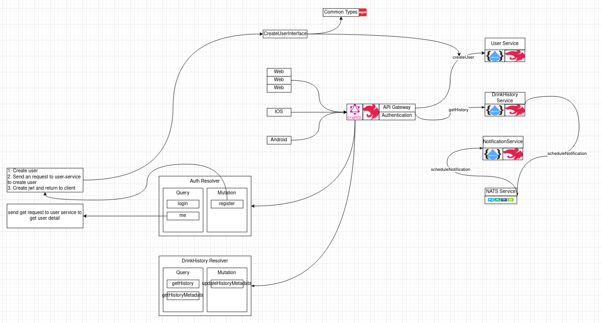

<!--  -->

### 1. Installing AWS CLI

https://docs.aws.amazon.com/cli/latest/userguide/install-cliv2-linux.html

### 2. Setting up credentials

Go to [i am user](https://console.aws.amazon.com/iamv2/home#/users) > `user` > `Security Credentials` > `Create Access Key`

```sh
nano ~/.aws/credentials
```

```sh
[default]
aws_access_key_id=
aws_secret_access_key=
```

### 3. Creating a cluster

```sh
eksctl create cluster \
--name test-cluster \
--version 1.21 \
--region ap-southeast-1 \
--nodegroup-name linux-nodes \
--node-type t2.micro \
--nodes 2
```
